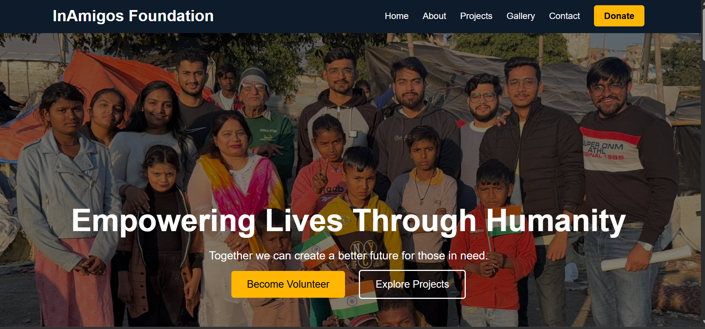
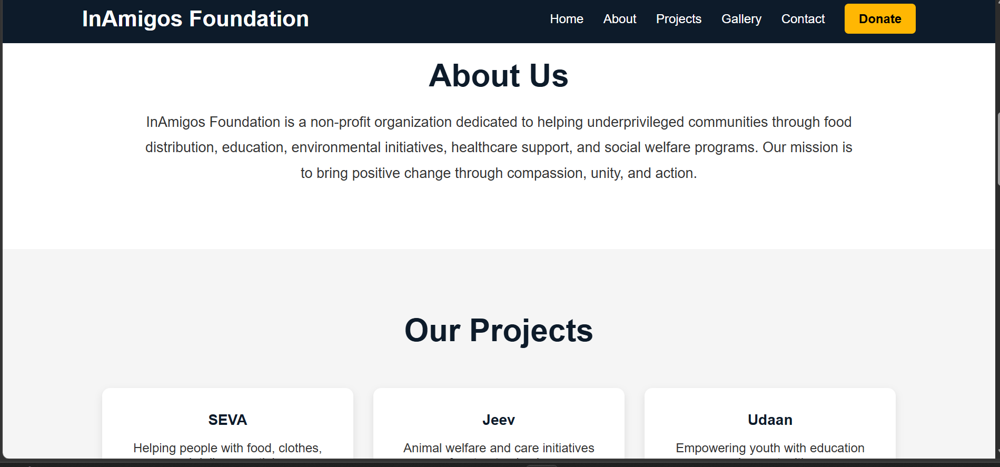
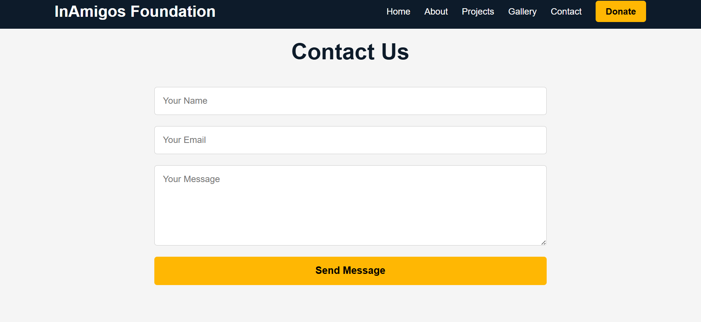

# InAmigos Foundation Web Platform

A responsive and modern web platform developed for InAmigos Foundation to create awareness about social initiatives, community welfare programs, and charitable activities. The website is designed with a clean and user-friendly interface to provide an engaging experience across different devices and screen sizes.

---

# Live Website

[Visit Website](https://akanshawalia10-eng.github.io/InAmigos-Foundation-Web-Platform/)

---

# Project Objective

The main objective of this project is to build a professional and accessible digital platform for InAmigos Foundation that effectively represents the organization’s mission, values, and impact on society.

This project aims to:

- Spread awareness about social welfare initiatives
- Promote community engagement and participation
- Showcase foundation projects and campaigns
- Improve the online presence of the organization
- Encourage volunteering and donations
- Create a responsive and visually appealing user experience

The project also focuses on enhancing frontend web development skills through practical implementation of responsive layouts, structured design, and interactive components.

---

# Features

- Responsive and mobile-friendly design
- Modern and clean user interface
- Hero section with impactful messaging
- About Us section
- Projects and initiatives showcase
- Gallery section
- Contact form
- Social media integration
- Smooth navigation experience

---

# Technologies Used

- HTML5
- CSS3
- JavaScript

---

# Website Preview

## Homepage


## About Section


## Contact Section


---

# Project Structure

```bash
InAmigos-Foundation-Web-Platform/
│
├── index.html
├── style.css
├── script.js
├── Screenshot1.png
├── Screenshot2.png
├── Screenshot3.png
├── Screenshot4.png
├── Screenshot5.png
└── Screenshot6.png
```

# Future Scope

The platform can be further enhanced with advanced functionalities and backend integration to improve scalability and user interaction.

Future improvements may include:

- Online donation system
- Volunteer registration portal
- Admin dashboard
- Database integration
- Event and campaign management system
- User authentication
- Blog and news section
- Email notification integration
- Real-time support/chat system
- Multi-language support
- SEO optimization
- Custom domain deployment

These enhancements can transform the project into a complete NGO management and community engagement platform.

---

# Learning Outcomes

Through this project, the following concepts and skills were explored:

- Frontend web development
- Responsive web design
- User interface development
- Website deployment using GitHub Pages
- GitHub repository management
- Project documentation
- Structured webpage design

---

# Author

**Akansha Walia**  
MCA Student | AI & Web Development Enthusiast | Data Analytics Learner

